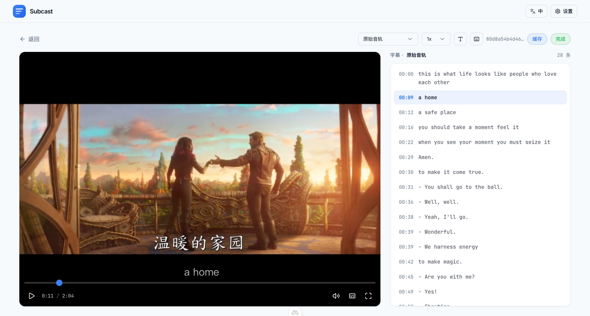

# Subcast

[](./LICENSE)
[](https://github.com/twoer/subcast/releases)
[](https://github.com/twoer/subcast/releases/latest)

> Free · Offline · LLM-powered — transcription, translation & AI summaries for audio/video
>
> 中文说明：[README.md](./README.md) &nbsp;·&nbsp; Docs: **https://twoer.github.io/subcast**

📥 **[Download latest →](https://github.com/twoer/subcast/releases/latest)** (macOS Apple Silicon, ~400 MB)

**Works out of the box:** the installer bundles the SenseVoice transcription model — drop in a video and start transcribing with zero downloads. Translation and AI summaries run on the built-in local Qwen3, downloaded once in-app on first use; after that **everything runs fully offline** — no cloud APIs, no telemetry, your data never leaves your machine.



## What it does

Drop in a video or audio file; everything else happens locally:

- 🎙 **Dual transcription engines** — SenseVoice (bundled; zh/en/ja/ko/yue, ~15× faster on CPU) plus on-demand Whisper (99 languages, word-level timestamps); the default `auto` mode dispatches per audio language
- ✨ **AI transcript polish** — the local Qwen3 fixes homophone typos, normalizes mixed Chinese/English tokens (a i → AI) and adds punctuation; the original transcript is preserved, switch between raw/polished with one click
- 🌍 **Multilingual translation** — local Qwen3 translates to any target language, switchable live in the player; export mono/bilingual/multi-lingual subtitles (VTT / SRT / TXT)
- 📝 **AI summaries + chapters** — one-click streaming summaries with clickable chapter markers
- ⚡ **Streaming + batch UX** — start watching while transcription runs; multi-file batches finish transcription and core subtitle output first, then continue enhancement work
- 🗣 **Speaker diarization** — separate speakers automatically, rename them, re-run with a different count
- 🔗 **URL import** — paste a link from YouTube / Bilibili and 1500+ sites, auto-downloaded and transcribed (only content you're entitled to — see the [disclaimer](./DISCLAIMER.md))
- 🔒 **Privacy first** — no accounts, no telemetry, no subscriptions; Settings shows when transcription and AI models are running, loaded, or waiting to auto-release

## Quick start (macOS)

1. Download the `.dmg` and drag **Subcast** into Applications
2. First launch says "damaged"? That's Gatekeeper flagging an unsigned app — run this once in Terminal:

   ```bash
   xattr -cr /Applications/Subcast.app
   ```

3. Follow the setup wizard (the transcription engine is bundled; AI features download a Qwen3 model on demand — the 4B tier is right for 8 GB machines)
4. Drop a video into the window and go

> 📌 **Windows**: builds are paused for this release and will return later.
>
> 📖 Full install guide, tutorials, model picks and FAQ live on the **[docs site](https://twoer.github.io/subcast)**.

## FAQ

| Symptom | Fix |
|---|---|
| macOS says "app is damaged" | Run `xattr -cr /Applications/Subcast.app` once |
| Model download is slow / stuck | Enable the **hf-mirror.com** mirror in the wizard or Models settings; partial downloads resume |
| English accuracy feels mediocre | Download a Whisper model (large-v3-turbo recommended) and re-transcribe; `auto` routes English to Whisper automatically |
| Found a bug | Help → Export Diagnostics (contains no media or transcript text) and attach it to an [issue](https://github.com/twoer/subcast/issues) |

## Run from source

```bash
pnpm install
pnpm dev:desktop:hot   # desktop dev mode (hot reload)
pnpm dev               # browser dev mode
pnpm test              # tests
```

Prerequisites and desktop packaging details: [CONTRIBUTING.md](./CONTRIBUTING.md), [AGENTS.md](./AGENTS.md) and [`docs/`](./docs/); packaging command: `pnpm build:desktop:mac`.

## License

[Apache-2.0](./LICENSE) © 2026 twoer — free to use, modify and distribute (including commercially). Third-party notices: [NOTICES.md](./NOTICES.md).

> The app ships unsigned ($0/year keeps the project sustainable) — the one-time Gatekeeper warning on first launch is expected.
