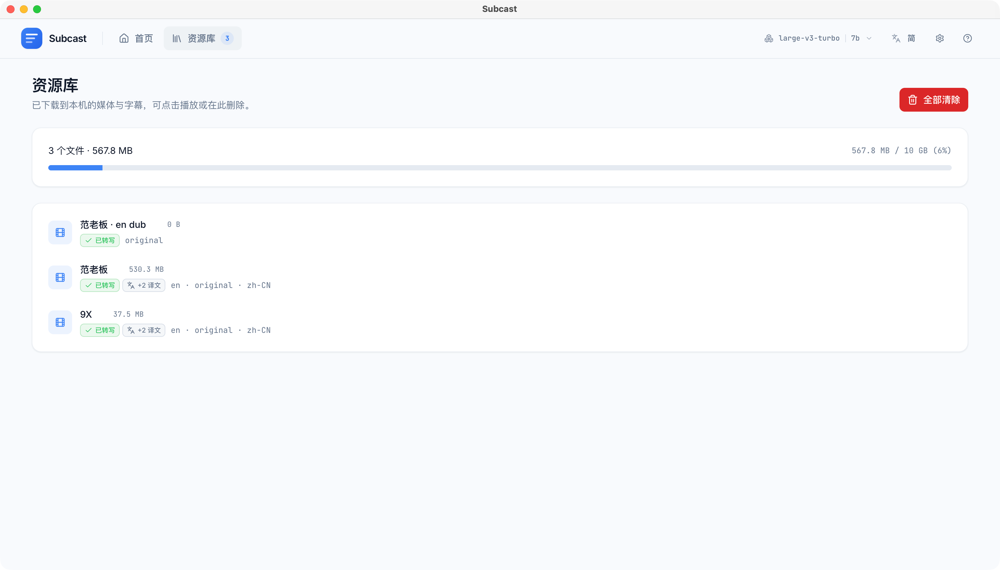
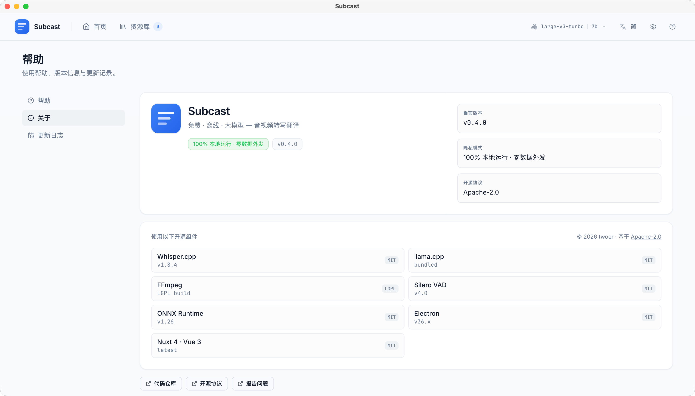

# Subcast

[](./LICENSE)
[](https://github.com/twoer/subcast/releases)
[](https://github.com/twoer/subcast/releases/latest)
[](https://github.com/twoer/subcast/releases/latest)

> 免费 · 离线 · 大模型 — 音视频转写翻译
>
> English: [README.en.md](./README.en.md)

> 📥 **[下载最新版 →](https://github.com/twoer/subcast/releases/latest)** &nbsp;·&nbsp; macOS (Apple Silicon) / Windows x64
>
> ✅ **开箱即用**：安装包内置 Whisper `base` 转写模型（~148 MB）和 Silero VAD，装完即可直接拖入视频开始转写，**无需联网下载任何东西**。
>
> ⚠️ **翻译 / AI 摘要**需要额外的 Ollama + Qwen 模型，首次配置需联网下载一次；下载完成后所有功能（含翻译、摘要）全部本地运行，**不联网、不调用付费 API、不上报任何遥测**，数据全部留在本机。

把视频拖进来 → 本地 Whisper 转写 → 边播放边按需翻译。Subcast 是面向 macOS / Windows 的桌面应用。同一套 Nuxt/Nitro 代码也用于 `pnpm dev` 本地开发——这只是无需重打包 Electron 时迭代 UI 的最快方式，**不是**一个可部署/对外提供服务的 Web 产品。

## 核心功能

- 🔒 **隐私优先** —— 所有数据与推理都在本地完成，敏感音视频不出本机
- 💸 **零成本** —— 不依赖任何云端 API，一次下载模型后零持续费用
- 🌍 **多语言翻译** —— 原文 + 任意目标语言，播放器里实时切换，已缓存语言打 ✓ 标记
- ⚡ **流式体验** —— 转写过程中即可开始观看，不必等整段跑完
- ✨ **AI 总结 + 章节** —— 播放器内一键生成；本地 Ollama 流式输出；章节可点击跳转
- ↩️ **断点续传** —— 中途强行结束进程，下次从最后一个已完成的 30s 分片继续
- 🎙 **语音感知分片** —— Silero VAD 预分段，Whisper 只处理真正的人声，大幅减少静音 / 纯音乐段的幻觉，长视频提速 30–50%
- 🚦 **自适应配置** —— 首次启动按硬件等级自动推荐 Whisper / Ollama 模型，并复用本机已有模型
- 📥 **导出 & 搜索** —— 单语 / 多语 / 双语字幕导出（VTT / SRT / TXT，多语自动 ZIP）；播放器内常驻搜索框，`/` 或 `Ctrl/Cmd+F` 聚焦，匹配高亮 + `Enter` / `Shift+Enter` 循环
- 🌊 **波形进度条** —— 内联音频波形可视化，点击 / 拖动精准定位；波峰在上传时预生成，播放器打开即开即用、零等待
- 🔗 **URL 导入** —— 粘贴 ScreenPal / B 站 / YouTube 等 1500+ 站点的网页链接，内置 yt-dlp sidecar 下载后自动进入转写流程，实时显示百分比进度。详见 [免责声明](./DISCLAIMER.md)（仅供导入你有权下载的内容）
- 🗂 **媒体库管理** —— 所有转写过的媒体集中管理，缓存用量、语言标记、任务状态一目了然；支持重命名、单条 / 批量删除

<details>
<summary><b>📖 为什么做这个项目？（适合谁用）</b></summary>

云端转写服务用便利换取你的媒体——每次上传都把敏感音视频（访谈、会议、语音备忘）暴露给第三方、受限于它支持的语言、按小时计费。Subcast 面向无法接受这种妥协的人：律师、记者、研究者，以及任何受保密或数据驻留约束的用户，还有更愿意把整套流程留在本机的本地大模型爱好者。转写、翻译、AI 摘要全部在单个应用里本地完成，**一次性下载模型后零持续成本、数据不离开你的机器**。

</details>

## 预览

**首页** —— 拖入视频，下方实时显示转写 / 翻译队列。


**媒体库** —— 所有转写过的媒体集中管理，显示缓存用量、语言标记、任务状态；支持重命名、单条 / 批量删除。



**播放器** —— 应用的核心。左侧视频（自定义控件 + 波形进度条，可拖动精准定位），右侧双标签：

- **字幕** —— 按语言切换的字幕列表，已缓存语言打 ✓ 标记，跟随播放进度高亮当前 cue；支持搜索高亮、说话人分组视图（说话人可重命名、可调整人数重跑）
- **AI 洞察** —— 一键生成本地 Ollama 流式摘要 + 可点击跳转的章节


**设置** —— 硬件信息 + 模型选择 + 缓存管理 + 字幕显示偏好。


**关于** —— 应用身份卡片、第三方依赖与许可证清单、仓库 / 许可证 / 提交 issue 链接。



---

## 桌面版安装

<!-- TODO: 此处插入 Setup Wizard Step 1 截图。 -->

### 下载

从 [Releases 页面](https://github.com/twoer/subcast/releases) 下载最新安装包：

| 平台 | 文件 | 体积约 |
|---|---|---|
| macOS（Apple Silicon） | `Subcast-<version>-arm64.dmg` | 260 MB |
| Windows（x64） | `Subcast-Setup-<version>.exe` | 240 MB |

**已内置**：Whisper `base` 模型（~148 MB）、Silero VAD（~2 MB）、ffmpeg/ffprobe、whisper-cli、llama-server——**装完即用，转写无需联网**。如需更高精度，可在设置里下载 `small` / `medium` / `large-v3`。

**首次需联网下载**（仅翻译 / 摘要用）：Ollama 运行时 + Qwen 语言模型，推荐档 `qwen2.5:7b` 约 4.7 GB。

### macOS

1. 双击 `.dmg`，把 **Subcast** 拖入 Applications。
2. 首次打开会提示 **"Subcast 已损坏，无法打开"** —— 这不是真的损坏，是 macOS Gatekeeper 对未签名 app 的拦截（Subcast 暂未购买 Apple 签名证书，见下方"License & 成本"）。任选一种方式处理，**只需一次**：

   - **方式一（推荐）**：打开终端（Terminal），粘贴这行回车：
     ```bash
     xattr -cr /Applications/Subcast.app
     ```
     然后双击 Subcast 即可正常打开。

   - **方式二**：在 Applications 里**右键** `Subcast.app` → **打开** → 弹窗选"打开"。
     （macOS 15+ 如果右键没用：系统设置 → 隐私与安全性 → 下拉至 *"Subcast 已被阻止"* → **仍要打开**。）

   <!-- TODO: 并排两张截图：终端 xattr 命令 + Gatekeeper 弹窗。 -->

3. 跟随首次运行向导：
   1. **Whisper 转录模型** —— `base` 已随安装包内置，可直接开始转写；如需更高精度，可在此下载 `small` / `medium` / `large-v3`。如果本机已有 `ggml-*.bin` 文件（如来自 [whisper.cpp](https://github.com/ggerganov/whisper.cpp) 或 [Aiko](https://sindresorhus.com/aiko)），Subcast 会提示软链接 / 复制，避免重复下载。
   2. **Ollama 运行时** —— 安装到独立目录，作为菜单栏程序常驻。Subcast 自动检测；如果未运行，点击"前往 ollama.com"，安装好后回到向导点"我已安装"重检即可。
   3. **Qwen 语言模型** —— 在 `3b` / `7b`（推荐）/ `14b` 中选择；本机已有的型号会自动标 ✓ 并优先选中。

4. 完成。把视频拖入主窗口，或者在 Finder 里右键 `.mp4`/`.mkv`/`.mov`/`.webm`/`.mp3`/`.wav`/`.m4a` → "打开方式 → Subcast"。

### Windows

1. 双击运行 `Subcast-Setup-<version>.exe`。SmartScreen 会提示 *"Windows protected your PC"* —— Subcast 使用自签名证书（见下方"License & 成本"）。

   - 点击 **More info** → 确认发布者为 **Subcast (twoer)** → **Run anyway**。

   <!-- TODO: SmartScreen 警告截图。 -->

2. 选择安装位置（默认按用户安装，`%LOCALAPPDATA%\Programs\Subcast`）。
3. 跟随与 macOS 完全一致的三步设置向导。
4. 安装器会把 **Subcast** 加入开始菜单，并可选地为上述媒体后缀注册"打开方式"项。

用户数据存放位置：Windows 下 `%APPDATA%\Subcast`，macOS 下 `~/Library/Application Support/Subcast`。模型、缓存字幕、日志都在这里 —— Subcast 不会写出其数据目录之外的任何位置。

---

## 日常使用

### 托盘 / 菜单栏图标

关闭主窗口只会**隐藏到托盘**，后台任务（转录、翻译、AI 摘要）继续跑。托盘菜单可以重新打开窗口、运行"导出诊断"、"检查更新"、退出。

`Cmd+Q` / `Ctrl+Q`（或托盘里的"退出"）才是真正的退出：所有正在运行的任务会被干净地取消并写入数据库，下次启动自动从最后一个分片继续。

### 播放器键盘快捷键

| 按键 | 操作 |
|---|---|
| Space / K | 播放 / 暂停 |
| ← / → | 后退 / 前进 5 秒 |
| J / L | 后退 / 前进 10 秒（YouTube 风格） |
| ↑ / ↓ | 音量 ±10% |
| < / > | 倍速调一档 |
| M / F / C | 静音 / 全屏 / 字幕开关 |
| 1-9 | 跳到视频 10%–90% 进度 |
| ? | 打开快捷键帮助 |
| Esc | 关闭任意对话框 |

---

## 排查

### 导出诊断

遇到问题时：**Help → Export Diagnostics…**（托盘菜单里也有）会把近 7 天的结构化日志 + 一份 `system.json`（OS、应用版本、硬件信息）打包成 zip。**不包含**任何视频、字幕文本、文件名 —— 提交 issue 时附上即可。

### 常见问题

| 现象 | 解决办法 |
|---|---|
| 向导显示"未检测到 Ollama"，但你已安装 | Ollama 是独立的菜单栏 / 任务栏程序。打开它的图标确认"正在运行"，回到向导点"我已安装"重检即可。 |
| Whisper 模型下载卡在 0% | 中国大陆用户：在向导里勾选"使用 hf-mirror.com"。已经下载的字节会在镜像上继续 —— 无需重头开始。 |
| macOS 15+ 上 Cmd-点击应用没反应 | 打开"系统设置 → 隐私与安全性"，在页面底部会有专门的"仍要打开"按钮（这个系统版本起，原先的"打开方式"菜单不再适用）。 |
| 转录到一半 Subcast 进程没了 | 直接重启。转录任务会从最后一个 30s 分片继续；翻译任务会被标记为"上次未完成"，主页给出"重试 / 忽略"按钮 —— 不会偷偷重新调用 Ollama 浪费 token。 |

---

## 自动更新

- **Windows** —— Subcast 在后台从 GitHub Releases 拉取差分包，下次启动时自动应用。差分包使用与安装器同一份自签名证书。
- **macOS** —— 手动：**Help → Check for Updates…**（启动后 5 秒也会静默检查一次，仅在"有新版本"时弹窗）。点击会在系统浏览器打开发布页，自行下载并替换 Applications 里的 .app。

---

## 开发者：从源码运行

桌面版底层就是 Nuxt 4 + Nitro，Web 模式直接 `pnpm dev` 就能在浏览器里跑。

### 前置依赖

| 依赖 | 用途 |
|---|---|
| Node.js 22+ | Nuxt 4 / Nitro 2 运行时 |
| pnpm 9+ | 包管理器 |
| ffmpeg + ffprobe | 提取音轨、读取时长 |
| cmake + C++ 工具链 | 首次构建 `whisper-cli` 二进制（仅源码模式需要） |
| 本地 Ollama 服务 | 默认监听 `http://localhost:11434` |

**模型 / 磁盘空间**：

| 配置档 | Whisper（转写） | Ollama（翻译） | 模型总占用 |
|---|---|---|---|
| **最小可跑** | `tiny` ≈ 78 MB | `qwen2.5:0.5b` ≈ 400 MB | **≈ 480 MB** |
| **推荐** | `base` ≈ 142 MB | `qwen2.5:7b` ≈ 4.7 GB | **≈ 5 GB** |
| 高精度 | `large-v3` ≈ 2.9 GB | `qwen2.5:14b` ≈ 9 GB | ≈ 12 GB |

**硬件加速**：whisper.cpp 在 Apple Silicon 上自动用 Metal、在 NVIDIA 上自动用 CUDA；Ollama 同理。无需额外配置。

### 安装依赖（仅源码模式）

#### macOS

```bash
brew install node pnpm ffmpeg cmake ollama
ollama serve
ollama pull qwen2.5:7b
```

#### Windows

```powershell
winget install OpenJS.NodeJS.LTS Gyan.FFmpeg Kitware.CMake Ollama.Ollama
npm install -g pnpm
ollama serve
ollama pull qwen2.5:7b
```

C++ 工具链：装 [Visual Studio Build Tools](https://visualstudio.microsoft.com/visual-cpp-build-tools/)，勾选"使用 C++ 的桌面开发"工作负载。

#### Linux

```bash
sudo apt install ffmpeg cmake build-essential
curl -fsSL https://ollama.com/install.sh | sh && ollama serve &
ollama pull qwen2.5:7b
```

### 跑起来

```bash
git clone https://github.com/twoer/subcast.git
cd subcast
pnpm install      # 首次较慢，会编译 better-sqlite3 等原生模块

# 编译 whisper-cli（仅源码模式）
cd node_modules/nodejs-whisper/cpp/whisper.cpp
cmake -B build
cmake --build build --target whisper-cli -j
cd -

# 下载 Whisper 模型
npx --no-install nodejs-whisper download

# 启动
pnpm dev          # http://localhost:3000
```

桌面构建：

```bash
pnpm build:desktop          # 当前平台
pnpm build:desktop:mac      # macOS arm64
pnpm build:desktop:win      # Windows x64
```

测试 / 类型检查：

```bash
pnpm test
pnpm typecheck
pnpm lint
```

### 设计文档

- [`docs/desktop-packaging.md`](./docs/desktop-packaging.md) —— 桌面架构 + 约 36 项设计决策
- [`docs/desktop-execution-plan.md`](./docs/desktop-execution-plan.md) —— Phase 0 到 Phase 5 的 file-by-file 执行计划
- [`docs/windows-codesigning.md`](./docs/windows-codesigning.md) —— Windows 自签名证书 runbook

---

## 贡献

欢迎提交 bug 报告、修复、文档与翻译。贡献指南见
[`CONTRIBUTING.md`](./CONTRIBUTING.md)（英文），其中包含开发环境、模块
边界、Pull Request 流程，以及一份适合首次贡献的
[good first issue 清单](./CONTRIBUTING.md#good-first-issues)。

本项目遵循 [Contributor Covenant 行为准则](./CODE_OF_CONDUCT.md)。
如发现安全漏洞，请按 [`SECURITY.md`](./SECURITY.md) 私下报告 ——
**不要**开公开 issue。

---

## License & 成本

[Apache-2.0](./LICENSE) © 2026 twoer —— **完全免费，可自由使用、修改、分发（含商业用途）**，无需付费、无需注册、无任何功能限制。

第三方组件（whisper-cli MIT、ffmpeg LGPL build、yt-dlp Unlicense、所有 npm 依赖）的归属与来源声明见 [`NOTICES.md`](./NOTICES.md)；LGPL 版 ffmpeg 对应源码可从 <https://ffmpeg.org/download.html> 获取。

> ⚠️ **关于 URL 导入功能**：内置的 yt-dlp 是通用下载工具，**仅供导入你有权访问 / 有权下载的内容**（自己上传的视频、CC 协议内容、公开课等）。用户需自行遵守当地版权法与各站点服务条款。完整的免责声明见 [`DISCLAIMER.md`](./DISCLAIMER.md)。

> 💡 **关于首次启动的"未知开发者"警告**：Subcast 不购买 Apple / Microsoft 的签名证书（见下方折叠说明），因此首次安装时会弹 Gatekeeper / SmartScreen 警告，按 [安装步骤](#桌面版安装) 点一次"仍要打开"即可，**不影响功能、不影响安全**——只是系统对未签名应用的通用提示。

<details>
<summary><b>🔧 维护者视角：为什么免费且能持续？（项目设计哲学）</b></summary>

按照设计，**发布 Subcast 的每年成本是 $0**，这是项目刻意的选择，也是能长期维护下去的前提：

- **macOS** —— 不加入 Apple Developer Program（$99/年）。用户首次启动看到 Gatekeeper 警告是预期内的，点一次即可。
- **Windows** —— 使用自签名代码证书（$0）。用户首次安装看到 SmartScreen 警告，走 *"More info → Run anyway"*。
- **分发** —— GitHub Releases（公开仓库免费）。
- **遥测 / 崩溃上报** —— **无**。诊断只在用户主动导出时打包。

如果要彻底消除首次警告，需要升级到 Apple Developer 账号 + Windows OV 证书（合计约 $300/年），目前不在路线图上。如果你愿意支持项目长期维护（例如赞助签名证书费用），欢迎通过仓库主页的联系方式与维护者沟通。

</details>
