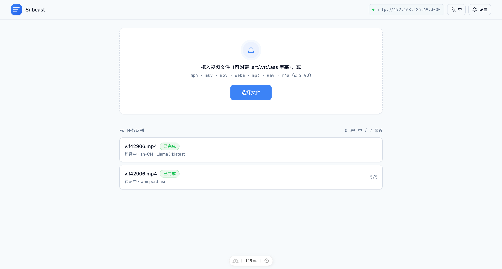
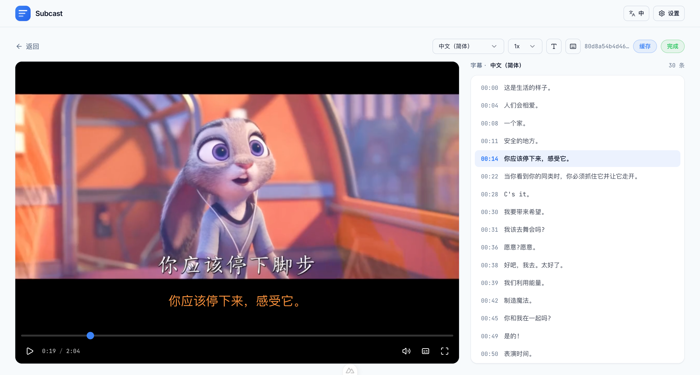
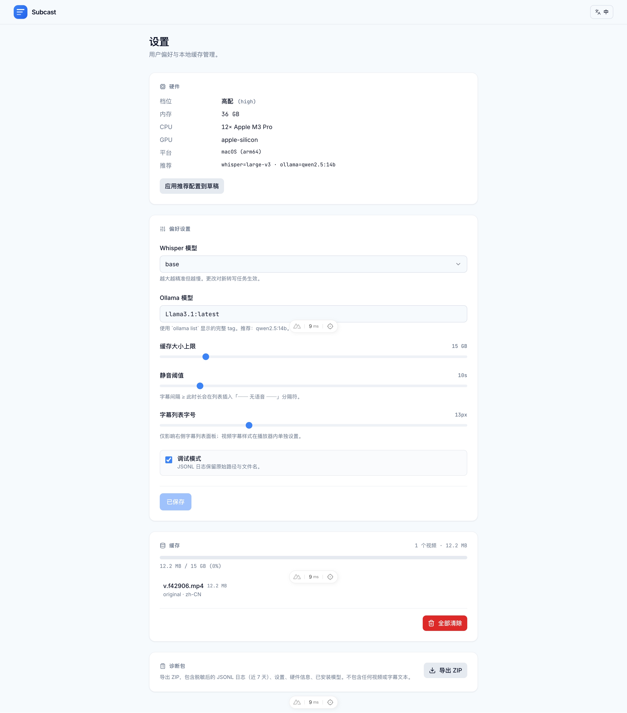

# Subcast

> Sub + Cast —— 完全本地的多语言字幕播放器。

把视频拖进来 → 本地 Whisper 转写 → 浏览器边播放边按需翻译。**不联网、不调用付费 API、不上报任何遥测，所有数据都留在本机。**

## 预览

**首页** —— 拖入视频，下方实时显示转写 / 翻译队列。



**播放器** —— 左边视频（自定义控件），右边按语言切换的字幕列表，已缓存语言在下拉里打 ✓ 标记，跟随播放进度高亮当前 cue。



**设置** —— 硬件信息 + 模型选择 + 缓存管理 + 字幕显示偏好。



▶️ **完整流程演示**：[demo/demo.mp4](demo/demo.mp4) （12 MB，从拖入视频到字幕翻译完成的全过程）

## 亮点

- 🔒 **隐私优先** —— 所有数据与推理都在本地完成
- 💸 **零成本** —— 不依赖任何云端 API
- 🌍 **多语言** —— 原文 + 任意目标语言，可实时切换
- ⚡ **流式体验** —— 转写过程中即可开始观看
- ↩️ **断点续传** —— 中途强行结束进程，下次会从最后一个已完成的 30s 分片继续
- 🚦 **自适应** —— 首次启动按硬件等级自动推荐 Whisper / Ollama 模型

## 技术栈

- **Nuxt 4** + Vue 3 + TypeScript（strict）+ Tailwind CSS + shadcn-vue
- **whisper.cpp**（通过 `nodejs-whisper`）—— 转写
- **Ollama** + `qwen2.5:7b`（默认，可在 Settings 修改）—— 翻译
- **better-sqlite3** + 文件系统缓存（统一放在 `~/.subcast/`）

## 前置依赖

| 依赖 | 用途 |
|---|---|
| Node.js 22+ | Nuxt 4 / Nitro 2 运行时 |
| pnpm 9+ | 包管理器（yarn / npm 也可） |
| ffmpeg + ffprobe | 提取音轨、读取时长 |
| cmake + C++ 工具链 | 首次构建 `whisper-cli` 二进制 |
| 本地 Ollama 服务 | 默认监听 `http://localhost:11434` |

**模型 / 磁盘空间**：

| 配置档 | Whisper（转写） | Ollama（翻译） | 模型总占用 |
|---|---|---|---|
| **最小可跑** | `tiny` ≈ 78 MB | `qwen2.5:0.5b` ≈ 400 MB | **≈ 480 MB** |
| **推荐** | `base` ≈ 142 MB | `qwen2.5:7b` ≈ 4.7 GB | **≈ 5 GB** |
| 高精度 | `large-v3` ≈ 2.9 GB | `qwen2.5:14b` ≈ 9 GB | ≈ 12 GB |

最小可跑能验证全流程，但转写 / 翻译质量都比较粗；要看出"成片"效果建议直接上推荐档。

**硬件加速**：whisper.cpp 在 Apple Silicon 上自动用 Metal、在 NVIDIA 上自动用 CUDA；Ollama 同理。无需额外配置。

macOS 一键安装：

```bash
brew install node pnpm ffmpeg cmake ollama
ollama serve         # 单独开一个终端常驻
ollama pull qwen2.5:7b
```

Linux：

```bash
sudo apt install ffmpeg cmake build-essential
curl -fsSL https://ollama.com/install.sh | sh && ollama serve &
ollama pull qwen2.5:7b
```

启动 Subcast 之前确认 Ollama 在跑：

```bash
curl http://localhost:11434
# 正常会返回：Ollama is running
```

## 首次安装

```bash
git clone https://github.com/twoer/subcast.git
cd subcast

# 编译 better-sqlite3 等原生模块，首次大概 1–2 分钟（看起来"卡住"是正常的）
pnpm install

# 编译 nodejs-whisper 需要的 whisper-cli 二进制（一次即可）
cd node_modules/nodejs-whisper/cpp/whisper.cpp
cmake -B build                                       # 首次必须先配置
cmake --build build --target whisper-cli -j
cd -

# 下载一份 Whisper 模型（交互式选择，建议先用 base 起步）
npx --no-install nodejs-whisper download
```

如果哪一步遗漏了，首页顶部会出现一个琥珀色横幅，里面会给出针对你当前平台的精确命令 —— 直接照着横幅做也行。

## 启动

```bash
pnpm dev
```

打开 http://localhost:3000 。默认监听 `0.0.0.0`，所以同局域网内的其他设备也可以访问 `http://<你的主机>:3000`（首页会显示局域网地址）。

需要从命令行强制指定 Ollama 模型（覆盖首次启动的推荐）：

```bash
SUBCAST_OLLAMA_MODEL=qwen2.5:7b pnpm dev
```

## 数据存放位置

所有用户数据统一放在 `~/.subcast/`：

```
~/.subcast/
├── videos/{sha256}.{ext}         # 上传的视频副本
├── cache/{sha256}/
│   ├── original.vtt              # 转写结果
│   ├── zh-CN.vtt                 # 按 BCP-47 语言代码缓存的翻译
│   └── meta.json                 # cue 数量、时间戳等元数据
├── logs/YYYY-MM-DD.jsonl         # 结构化日志（保留 14 天）
├── data.sqlite                   # 任务、分片、字幕、设置
└── tmp/                          # ffmpeg 临时文件 / 上传暂存
```

清理缓存有两种方式：在 **Settings** 页里删除单条或一键清空，或直接调 API：

```bash
curl -X DELETE http://localhost:3000/api/cache/<sha256>
curl -X DELETE http://localhost:3000/api/cache/clear
```

## Settings 页配置

`/settings` 提供以下选项：

- **Whisper 模型** —— `tiny / base / small / medium / large-v3`。首次启动会按硬件等级（入门 / 标准 / 推荐 / 高配）自动选择。
- **Ollama 模型** —— 完整 tag（如 `qwen2.5:7b`），推荐项同样按硬件等级给出。
- **缓存大小上限** —— 使用率 ≥ 90% 时 UI 会出现告警。
- **静音阈值** —— 字幕间隔超过该时长时，列表中插入「── 无语音 ──」分隔符（仅 UI 层显示，不会写入 VTT）。
- **字幕列表字号** —— 右侧字幕列表面板的字号，11–18px，默认 13px（仅 UI 偏好，存浏览器 localStorage）。
- **调试模式** —— 在 JSONL 日志中保留原始路径 / 文件名（默认会做哈希脱敏）。

设置保存在 `~/.subcast/data.sqlite` 的 `settings` 表里，对**后续任务**生效。

## API 端点

| 方法 | 路径 | 用途 |
|---|---|---|
| POST | `/api/upload` | 上传视频（可附带 `subtitle` 伴生字幕文件） |
| GET | `/api/transcribe?hash=` | SSE：流式输出 cue；命中缓存时直接重放 |
| GET | `/api/translate?hash=&lang=` | SSE：翻译为指定语言（BCP-47），命中缓存直接重放 |
| GET | `/api/video?hash=` | 支持 Range 的视频流（供 `<video>` 标签使用） |
| GET | `/api/queue/list` | 当前 + 最近的转写 / 翻译任务 |
| DELETE | `/api/queue/transcribe/:id` | 取消转写任务 |
| DELETE | `/api/queue/translate/:id` | 取消翻译任务 |
| GET | `/api/cache/list` | 列出缓存视频，含体积与已译语言 |
| DELETE | `/api/cache/:hash` | 删除单条缓存 |
| DELETE | `/api/cache/clear` | 清空全部缓存 |
| GET | `/api/health` | 硬件 + Ollama + Whisper 就绪状态 |
| GET / PUT | `/api/settings` | 读取 / 写入设置 |
| GET | `/api/diagnostic` | 打包诊断 ZIP（脱敏日志 + 设置 + 硬件 + 模型清单） |

## 播放器键盘快捷键

| 按键 | 操作 |
|---|---|
| Space / K | 播放 / 暂停 |
| ← / → | 后退 / 前进 5 秒 |
| J / L | 后退 / 前进 10 秒（YouTube 风格） |
| ↑ / ↓ | 音量 ±10% |
| < / > | 倍速调一档（0.5 / 0.75 / 1 / 1.25 / 1.5 / 1.75 / 2） |
| M / F / C | 静音 / 全屏 / 字幕开关 |
| 1-9 | 跳到视频 10%–90% 进度 |
| ? | 打开快捷键帮助 |
| Esc | 关闭任意对话框 |

## 开发

```bash
pnpm dev            # 启动开发服务器
pnpm test           # vitest 单测
pnpm typecheck      # nuxt typecheck（首次较慢）
pnpm build          # 生产构建（.output/）
```

架构要点：

- **流式队列模型** —— 转写和翻译都是基于 SQLite 的单并发队列。SSE 接口本质是 `queue.attach(taskId)` 的薄封装：先重放历史帧，再推送实时帧。分片在 Nitro 进程之间持久化，所以重启也能续上。
- **幻觉重试阶梯** —— 每个 30 秒分片最多 3 次尝试（temperature 0 → 0.4 → 0.8，第 1 次失败后即丢弃 prompt context）；3 次都失败则在 UI 上标记为 `quality='suspect'`。详见 `server/utils/quality.ts`。
- **翻译重试阶梯** —— 40 cue 的大批次失败时，回退到 15 cue 子批次；再失败则逐 cue 翻译。详见 `server/utils/ollama.ts`。
- **导入字幕** —— 上传时附带的 `.srt/.vtt/.ass` 会直接写入 `cache/{sha}/original.vtt`，并伪造一条 `transcribe_tasks` 记录（`model='imported'`），让原有的重放逻辑直接复用。

完整设计文档参见 `docs/superpowers/specs/2026-05-09-subcast-design.md`；最初的 walking-skeleton 计划参见 `docs/superpowers/plans/2026-05-09-subcast-slice-1-walking-skeleton.md`。

## 常见问题排查

| 现象 | 可能原因 / 解决办法 |
|---|---|
| `whisper-cli executable not found` | 在 `node_modules/nodejs-whisper/cpp/whisper.cpp/build` 下重新跑一次 cmake 构建 |
| `OLLAMA_UNREACHABLE` | `ollama serve` 没启动，或自定义了 `SUBCAST_OLLAMA_URL` 环境变量 |
| `MODEL_NOT_PULLED` | 执行 `ollama pull <model>`，或在 Settings 里改成已存在的模型 |
| 翻译质量飘忽、出现幻觉 | 改用 `qwen2.5:7b`（或更大的模型），不要用未经指令调优的通用模型（如 Llama） |
| `<video>` 无法拖动进度条 | 后端必须支持 HTTP Range，本项目已支持；但反向代理可能会剥离 Range 头 |

## License

TBD（见设计文档 §9 待决策项 —— 候选：MIT / Apache 2.0 / GPL）。
