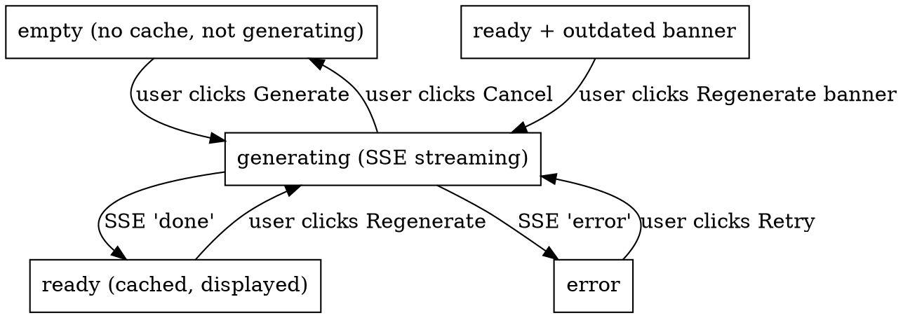

# Subcast — AI Insights (Summary + Chapters) Design Spec

> 在播放器右侧字幕区新增 Tab，提供 AI 生成的"全文总结 + 章节"。完全本地，沿用既有 Ollama 实例。
> 本文为 superpowers brainstorming 流程产出。下游：`writing-plans` 生成实施计划。

**版本**：v1.0
**创建日期**：2026-05-12
**关联**：
- `docs/superpowers/specs/2026-05-09-subcast-design.md`（V1.0 主设计）
- `docs/superpowers/specs/2026-05-12-player-ux-enhancement-design.md`（同期 export + search 增强，不冲突）

---

## 决策摘要

经一问一答 brainstorming 确认：

| 维度 | 选择 | 否决项 / 理由 |
|---|---|---|
| **核心交付** | 总结 + 章节，**单次 Ollama 调用**同时产出 | 仅总结 / 仅章节都有价值，但组合覆盖最大 |
| **显示位置** | 右侧字幕区**新增 Tab**：`[字幕列表 \| ✨ AI 总结]` | 不动 video 列（不在进度条加章节 strip） |
| **章节展示** | 仅在 AI 总结 tab 里列出（带章节级摘要） | 不在进度条加可视化 strip |
| **默认 Tab** | 字幕列表（保持现状） | Subcast 主打看片，AI 是辅助 |
| **Ollama 输入** | 原文 VTT（`original.vtt`） | 不送已翻译的 VTT（避免错误叠加） |
| **输出语言** | **UI 语言**（i18n setting：`en` / `zh-CN`） | 不跟随字幕 tab 语言；不双语 |
| **触发时机** | 用户点 Tab，无缓存时显式按钮 `✨ Generate` | 不自动跑（隐私 + 算力） |
| **进度展示** | **SSE 流式 token 输出**（同既有 transcribe/translate） | 不用旋转 spinner / 不做估算进度条 |
| **取消** | DELETE endpoint（同 translate cancel） | — |
| **输出格式** | **Markdown + sentinels**（`## Summary` / `## Chapters` + `[HH:MM:SS]`） | 不用 Ollama 的 `format: "json"`（破坏流式） |
| **章节时间戳** | 后端 **snap 到最近 cue 起始 ms** | — |
| **章节数量** | 模型自主判断（3-8 章常态）；< 2 → 隐藏章节区 | 不强制固定数 |
| **Summary 形态** | 一段 100-300 字总览 + 3-5 条 bullet | — |
| **缓存键** | `~/.subcast/cache/{sha}/insights.json` （单份） | 不按语言分多份缓存 |
| **缓存失效** | 元数据对比：模型 / cue 数变 → 横幅提示 `[Regenerate]`；**UI 语言变 → 直接清** | — |
| **错误重试** | 格式错乱 → 1 次（temp 0）；空 → 1 次；仍失败 → lenient parser 兜底；全失败 → 显式报错 + raw 保留 | — |
| **超长视频** | 超过模型 context 直接报错 "Video too long" | 不做 map-reduce |

---

## §1 — 范围与文件清单

**新增**

| 路径 | 类型 | 职责 |
|---|---|---|
| `server/api/insights.get.ts` | API | SSE 流式生成 insights |
| `server/api/insights/[id].delete.ts` | API | 取消进行中的 insight 任务 |
| `server/utils/insights.ts` | Util | prompt 构造、流式 parser、时间戳 snap |
| `app/components/InsightsPanel.vue` | Component | Tab 内容：状态机 + summary + chapters |
| `app/components/ui/tabs/*` | Component | shadcn-vue Tabs（4 个文件） |
| `server/utils/__tests__/insights.test.ts` | Test | parser + snap + prompt 单测 |
| `server/utils/__tests__/insights-api.test.ts` | Test | SSE 序列 + 缓存命中 + 错误码（mock Ollama） |

**修改**

| 路径 | 改动 |
|---|---|
| `server/utils/db.ts` | 新增 migration v7：`insight_tasks` 表 |
| `server/api/cache/list.get.ts` | 返回项增 `hasInsights: boolean` 字段 |
| `server/api/cache/[hash].delete.ts` | 删视频时连带删 `insights.json` + `insights.json.raw.txt` + 级联 `DELETE FROM insight_tasks WHERE video_sha = ?` |
| `app/pages/player/[hash].vue` | 把右侧字幕面板包进 `<Tabs>`，第二个 tab 挂 `InsightsPanel` |
| `i18n/locales/{en,zh-CN}.json` | 新增 `player.insights.*` 命名空间 |
| `README.md` | 端点表加 `/api/insights`；亮点段加一行 |

---

## §2 — `/api/insights` 端点契约

### 请求

```
GET /api/insights?hash=<sha256>
```

仅 hash 一个参数。UI 语言由服务端从 `settings.uiLanguage` 或 `Accept-Language` 头读取（实现细节见 §5）。

### 响应（SSE）

| event | data | 触发时机 |
|---|---|---|
| `start` | `{ taskId, model, uiLanguage }` | 任务开始 |
| `token` | `{ text }` | Ollama 流出每个 token；前端追加渲染 |
| `done` | `{ insights }` | 解析 + 时间戳 snap 后的最终结构化结果；前端持久化此为最终视图 |
| `error` | `{ code, message }` | 任何错误（`OLLAMA_UNREACHABLE` / `MODEL_NOT_PULLED` / `VIDEO_TOO_LONG` / `PARSE_FAILED` / `FATAL_UNKNOWN`） |

**缓存命中重放**：与 transcribe/translate 一致——存在 `insights.json` 时直接 SSE 发 `done` 事件并关闭流，前端不感知是否命中。

### 错误码

| 码 | HTTP 等价 | 触发 |
|---|---|---|
| `BAD_HASH` | 400 | hash 不合法 |
| `VIDEO_NOT_FOUND` | 404 | DB 无该视频 |
| `NO_ORIGINAL_VTT` | 400 | 视频还没转写完，`original.vtt` 不存在 |
| `OLLAMA_UNREACHABLE` | 502 | 与 translate 一致 |
| `MODEL_NOT_PULLED` | 502 | 与 translate 一致 |
| `VIDEO_TOO_LONG` | 413 | 估算 prompt tokens > 模型上下文阈值（写死 28k 作为安全边界） |
| `PARSE_FAILED` | 502 | 两次重试后仍无法 parse |
| `FATAL_UNKNOWN` | 500 | 兜底 |

### Cancel

```
DELETE /api/insights/:id
```
- 取消还在进行的任务，删除 task 记录，**不**删除磁盘缓存（如果之前有过成功结果）
- 返回 `{ ok: true }`

---

## §3 — 数据模型

### `insight_tasks` 表（migration v7）

```sql
CREATE TABLE insight_tasks (
  id              TEXT PRIMARY KEY,
  video_sha       TEXT NOT NULL REFERENCES videos(sha256),
  status          TEXT NOT NULL,   -- queued / running / done / error / canceled
  model           TEXT NOT NULL,   -- e.g. 'qwen2.5:7b'
  ui_language     TEXT NOT NULL,   -- e.g. 'zh-CN'
  error_msg       TEXT,
  created_at      INTEGER NOT NULL,
  completed_at    INTEGER,
  UNIQUE (video_sha, ui_language)
);
CREATE INDEX idx_insight_status ON insight_tasks(status);
```

### `insights.json` 磁盘格式

```json
{
  "summary": "本视频讨论了……",
  "summaryBullets": [
    "要点 1",
    "要点 2",
    "要点 3"
  ],
  "chapters": [
    { "startMs": 0, "title": "开场与背景", "description": "讲者介绍了……" },
    { "startMs": 204000, "title": "工具链选择", "description": "对比了 X 和 Y……" }
  ],
  "_meta": {
    "ollamaModel": "qwen2.5:7b",
    "uiLanguage": "zh-CN",
    "originalCueCount": 142,
    "generatedAt": 1715520000000,
    "rawMarkdown": "## Summary\n..."
  }
}
```

`rawMarkdown` 保留原始流式输出，方便日后改 parser 或排查。

### `insights.json.raw.txt`（仅失败兜底）

只有当 parse 完全失败时写入。包含 Ollama 完整原始响应。下次用户点 Generate 时 UI 会提示 "Previous attempt failed, raw output available."

---

## §4 — Prompt 设计

`server/utils/insights.ts` 的 `buildPrompt(transcript, uiLang)`：

```
You are summarizing a video transcript. Output strict markdown following the
template below. Do not add any other sections, code fences, or commentary.

LANGUAGE: All output text MUST be in {uiLang}. ({uiLang} = "zh-CN" → Simplified
Chinese; "en" → English. Other codes default to English.)

TEMPLATE:
## Summary

<one paragraph, 100-300 words, written naturally>

- <key point 1>
- <key point 2>
- <key point 3>
(3 to 5 bullets total)

## Chapters

- [HH:MM:SS] <Chapter title> — <one-sentence description>
- [HH:MM:SS] <Chapter title> — <one-sentence description>
(3 to 8 chapters total; use exact timestamps that appear in the transcript)

TRANSCRIPT:

{vtt content with timestamps}
```

**Ollama 调用参数**：
- `temperature: 0.3`（第一次）
- `temperature: 0.0`（重试时）
- `stream: true`
- `num_ctx`: 不设（让 Ollama 用模型默认，qwen2.5 是 32k）

---

## §5 — UI 语言来源

按优先级回退：
1. 读取 `settings` 表里 `ui_language` 字段（如果有，未来 Settings 页加该开关）
2. 否则读 `Accept-Language` 头，匹配 `zh*` → `zh-CN`，其他 → `en`
3. 默认 `en`

**当前实现**：先做 (2) + (3)，把 (1) 留作未来扩展（不阻塞本 spec）。

---

## §6 — 解析器（`parseInsights(markdown)`）

### 流程

1. 用正则切出 `## Summary` 和 `## Chapters` 两段
2. Summary 段：第一段连续非空行作为 `summary` 字符串；后续 `- ` 开头行作为 `summaryBullets`
3. Chapters 段：每行匹配 `^- \[(\d{1,2}:\d{2}(:\d{2})?)\]\s*(.+?)(?:\s*[—–-]\s*(.+))?$`
   - 捕获 timestamp、title、可选 description
   - 把 `HH:MM:SS` / `MM:SS` 转 ms
4. **时间戳 snap**：每个章节 ms → 最近的 cue start ms（用 binary search，已知 cue 列表按时间排序）
5. 去重：相邻两章 startMs 相同则只保留第一个
6. 排序：按 startMs 升序

### Lenient 兜底

若 strict 解析得到的 chapters < 1 但 summary 段非空，仍返回部分结果（`chapters: []`），UI 隐藏章节区，只显示 summary。

若 summary 段也提取不出 → 抛 `PARSE_FAILED`。

---

## §7 — `InsightsPanel.vue` 状态机



**到达 `outdated`**：
- 缓存里的 `_meta.ollamaModel` ≠ 当前 settings 模型
- 或 `_meta.originalCueCount` ≠ 当前 cue 数

**到达 `empty`**：
- 无缓存
- 或缓存里的 `_meta.uiLanguage` ≠ 当前 UI 语言（直接清磁盘文件并清 task 记录）

### Tab Badge

- 任意状态下 tab 标题加一个圆点：
  - `generating` → 蓝点（呼吸动画）
  - `ready` → 无点
  - `outdated` → 黄点
  - `error` → 红点

---

## §8 — 错误处理总览

| 场景 | 行为 |
|---|---|
| Ollama 不可达 | 显示 retry CTA，文案同 translate 错误 |
| 模型没拉 | 显示 retry CTA + 命令提示 `ollama pull <model>` |
| 解析失败（第一次） | 自动重试 1 次（temp 0），用户无感 |
| 重试仍失败 | 显示 "Generation failed. Try again or check the raw output." + 按钮 "Show raw" 弹出 `.raw.txt` 内容 |
| 视频过长（> 28k tokens） | 显示 "Video too long for AI insights. Current model supports up to ~4 hours of dense dialogue." 无 retry |
| 用户切走 tab | SSE 保持连接（流继续后台跑）；返回 tab 时无缝续 |
| 用户关闭播放器页 | 自动调用 DELETE，取消任务 |

---

## §9 — 性能 / 资源

- **触发**：完全 on-demand，无后台预生成
- **并发**：和 translate 共享 Ollama 单并发（同一个 Ollama 实例同时只跑一件事）。如果用户在生成 insights 时切语言触发 translate，translate 排队等 insights 完成
- **内存**：流式输出，server 不缓冲完整响应。Markdown 边到边解析（仅 final `done` 事件时做严格 parse）
- **磁盘**：单个 `insights.json` < 10 KB（典型）；超长视频 raw 输出 < 50 KB

---

## §10 — 测试

### 必写（vitest）

`server/utils/__tests__/insights.test.ts`
- `buildPrompt`：包含 transcript 内容；语言指令正确
- `parseInsights` strict：标准格式 → 完整结构
- `parseInsights` lenient：缺章节段 → summary 仍能出，chapters []
- `parseInsights` 完全失败 → 抛异常
- 时间戳 snap：`03:25` + cue starts `[3000, 3500, 4000]` → snap 到 3500
- 时间戳格式：`HH:MM:SS` / `MM:SS` 都能解析
- 章节去重：相邻同 startMs 只保留首条
- 章节越界丢弃：startMs > video duration 的章节被丢

`server/utils/__tests__/insights-api.test.ts`（轻量集成）
- 不联 Ollama，mock 流：验证 SSE 事件序列 `start → token* → done`
- 缓存命中：直接发 `done`，不调 Ollama
- 视频过长：抛 `VIDEO_TOO_LONG`

### 不写

- `InsightsPanel.vue` 组件层 vue-test-utils（成本高、价值低；手测 + 状态机覆盖）

### 手动 QA

- 拖一个 5-30 分钟 vlog → 转写完成 → 点 Tab → 点 Generate → 流式看到 token 出现 → 完成显示章节列表 → 点章节跳转视频
- 删 `~/.subcast/cache/{sha}/insights.json` → 下次进入应回到 empty 状态
- 修改 Ollama 模型 → 进入 tab 应看到黄色 outdated 横幅

---

## §11 — YAGNI（明确不做）

- ❌ 自动批量生成所有已转写视频的 insights
- ❌ Insights 编辑（用户修改 summary / chapter title）
- ❌ 多语言并存缓存（B 选项）
- ❌ 进度条上的章节 strip
- ❌ Map-reduce 处理超长视频
- ❌ Settings 页加 UI 语言开关（先用 Accept-Language 头）
- ❌ Insights 分享 / 导出
- ❌ 章节级 seek 时切回字幕 tab（用户点章节后保持在 insights tab，不强制切换）

---

## §12 — 风险登记

1. **Ollama 输出格式不稳定**：温度 0.3 时 qwen2.5 偶尔加额外段落。已用 strict parser + 重试 + lenient 兜底应对
2. **超长视频边界**：写死 28k tokens 阈值，但实际单 token ≈ 1.5 字符；4 小时密集对话 ≈ 100k 字符 ≈ 67k tokens → 不够用。**接受**：用户拿到错误时手动剪辑或换模型（qwen2.5:32b 有 128k 上下文）
3. **章节时间戳错位**：模型自由生成可能不对齐 cue。snap 缓解；极端情况章节 timestamps 全失败 → lenient 路径回到"仅 summary"
4. **Ollama 单并发竞争**：用户连续切语言 + Generate Insights 时排队感知。可接受（既有 translate 也是这样）

---

## §13 — 验收标准

V1.0 可上线判定：

1. 打开一个已转写完的视频 → 字幕区可见 `[字幕列表 \| ✨ AI 总结]` Tab
2. 默认 Tab 是字幕列表（与原有行为一致）
3. 点 `✨ AI 总结` → 显示 "Generate AI insights" 按钮（首次）
4. 点 Generate → SSE 流式出现 summary 段落 → bullets → chapters，每个 token 边到边渲染
5. 完成后页面显示结构化的 summary（段落 + bullets）+ chapter list（每条带时间标 + 标题 + 描述）
6. 点 chapter → 视频跳到对应 cue 起始时间
7. 关掉播放器再回来 → tab 显示缓存的 insights（瞬时）
8. Settings 改 Ollama 模型 → 重进播放器 → tab 顶部出现黄色 outdated 横幅
9. 浏览器 UI 切换 zh-CN ↔ en → tab 回到 empty 状态（旧缓存清掉）
10. Generate 期间点 Cancel → 流终止；DB 任务记录变 `canceled`
11. `pnpm test` 全绿；`pnpm typecheck` 干净
12. 删视频时连带删 `insights.json`（缓存清理一致性）
